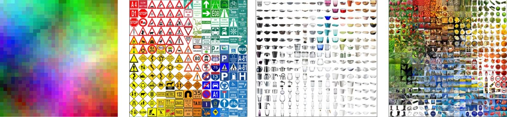
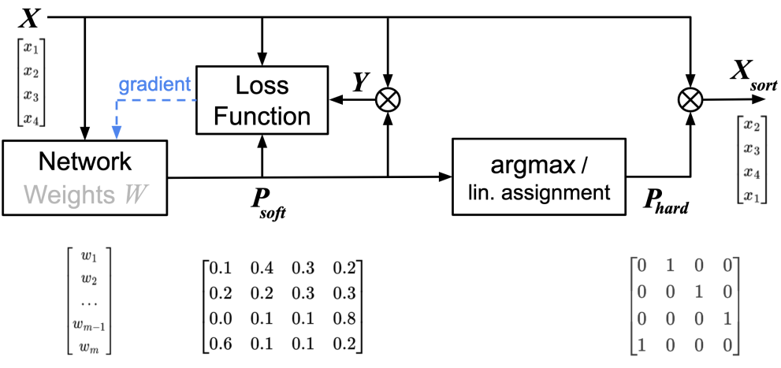
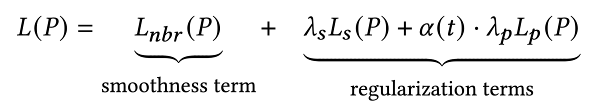
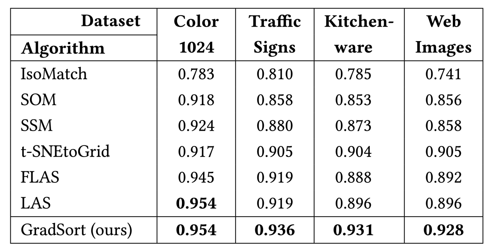
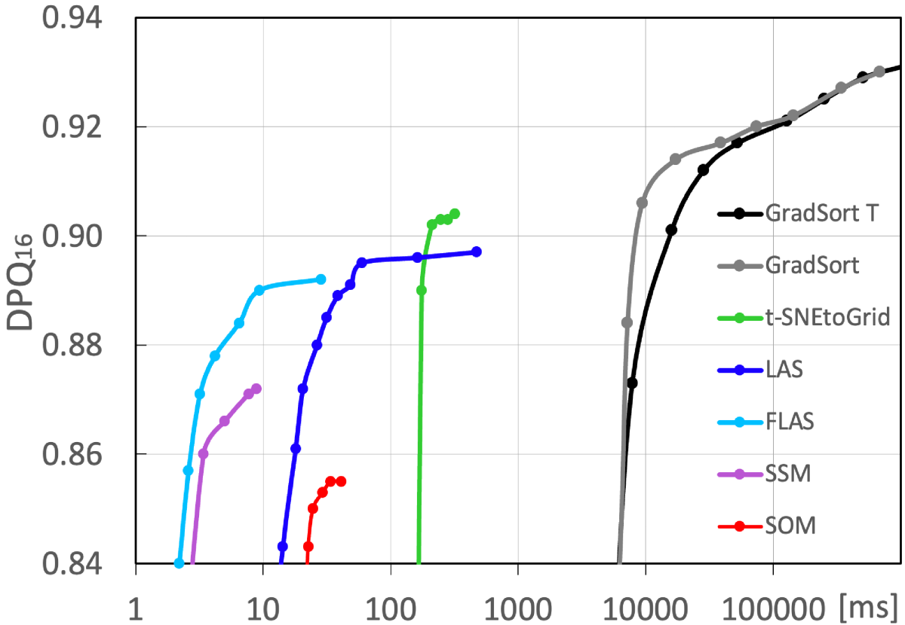

# GradSort

**Kai Barthel, Florian Tim Barthel, Peter Eisert, Nico Hezel, and Konstantin Schall**

***HTW Berlin, Visual Computing Group and Fraunhofer HHI***

[Visual Computing Group](https://visual-computing.com/)

This is an example implementation of the algorithms from the paper 

## Creating Sorted Grid Layouts with Gradient-based Optimization

Published in the Proceedings of the 2024 International Conference on Multimedia Retrieval: <br>
https://dl.acm.org/doi/10.1145/3652583.3657585

</img>

### Abstract

Visually sorted grid layouts provide an efficient method for organizing high-dimensional vectors in two-dimensional space by aligning spatial proximity with similarity relationships. This approach facilitates the effective sorting of diverse elements ranging from data points to images, and enables the simultaneous visualization of a significant number of elements. However, sorting data on two-dimensional grids is a challenge due to its high complexity. Even for a small 8-by-8 grid with 64 elements, the number of possible arrangements exceeds 1.3 * 10^89 - more than the number of atoms in the universe - making brute-force solutions impractical. Although various methods have been proposed to address the challenge of determining sorted grid layouts, none have investigated the potential of gradient-based optimization. In this paper, we present a novel method for grid-based sorting that exploits gradient optimization for the first time. We introduce a novel loss function that balances two opposing goals: ensuring the generation of a "valid" permutation matrix, and optimizing the arrangement on the grid to reflect the similarity between vectors, inspired by metrics that assess the quality of sorted grids. While learning-based approaches are inherently computationally complex, our method shows promising results in generating sorted grid layouts with superior sorting quality compared to existing techniques.

### Contributions

</img>

The principle of permutation learning involves training a network with weights W to learn the differentiable permutation matrix P_soft based on a specified loss function. The input vectors X are rearranged into Xsort using the permutation matrix P_hard, which is a binarized version of P_soft.

We propose a combined loss function using a smoothness term (for good sorting quality) and two regularization terms (to guarantee a valid permutation matrix).

</img>


### Results

Comparison of grid-based sorting methods for different test sets based on maximum achievable average DPQ16 value (higher is better). Our new GradSort scheme was trained for up to 100,000 steps.
</img>

The following figure shows the comparison of the runtime and the achieved sorting quality of different sorting algorithms with the kitchenware image set. GradSort is our proposed gradient-based sorting scheme, GradSort T uses an additional transformer.

</img>


### Example

We provide Jupyter notebooks with full python code for the sorting algorithm for images and colors (with and without transformer):

[GradSort for Images](python/GradSort_Images.ipynb) <br>
[GradSort for Colors](python/GradSort_Colors.ipynb)

Please install the python packages listed in [python/requirements.txt](python/requirements.txt) before executing the notebook on your local machine

```bash
pip install -r requirements.txt
```

We added the images and feature vectors from the sets described in the paper. Please unzip the data.zip file before running the notebooks.

## Reference

Reference to cite when you use any of the presented algorithms in a research paper:
```
@inproceedings{10.1145/3652583.3657585,
author = {Barthel, Kai Uwe and Barthel, Florian Tim and Eisert, Peter and Hezel, Nico and Schall, Konstantin},
title = {Creating Sorted Grid Layouts with Gradient-based Optimization},
year = {2024},
isbn = {9798400706196},
publisher = {Association for Computing Machinery},
address = {New York, NY, USA},
url = {https://doi.org/10.1145/3652583.3657585},
doi = {10.1145/3652583.3657585},
booktitle = {Proceedings of the 2024 International Conference on Multimedia Retrieval},
pages = {1199–1206},
numpages = {8},
location = {Phuket, Thailand},
series = {ICMR '24}
}
```
